# Planificación: SaaS para Clubes Deportivos - Clubify (Versión 1)

Este archivo contiene la planificación consolidada para la primera etapa del proyecto.

---

## 1. Estructura del Sitio Web Público

*   **Inicio (Portada)**: Banner hero, widget de próximo partido destacado, carrusel de sponsors y últimas 3 noticias.
*   **El Club**:
    *   *Historia*
    *   *Comisión Directiva*
    *   *Instalaciones*
    *   *Sponsors*
    *   *Contacto*
*   **Disciplinas / Deportes**:
    *   *Disciplinas*: Listado general con horarios y profesores.
    *   *Planteles*: Jugadores y cuerpos técnicos por categoría.
    *   *Partidos (Fixture)*: Calendario y resultados filtrables por deporte y categoría.
*   **Prensa**:
    *   *Noticias* (Blog y suscripción a Newsletter).
    *   *Galería* (Álbumes de fotos).
*   **Botón Socios (CTA)**:
    *   Formulario para asociarse en línea y listado de beneficios.

### Compartir en Redes
Integración de botones para compartir de forma directa noticias, disciplinas, álbumes de fotos y partidos vía Web Share API o enlaces directos.

---

## 2. Planes de Suscripción (Versión 1)

### Plan Básico
*   **Dominio**: Subdominio del SaaS (ej: `club.clubify.app`).
*   **Límites**: Hasta 5 disciplinas, máximo 10 noticias/mes (historial de 30), máximo 10 fotos por álbum.
*   **Diseño**: 1 foto fija en el banner hero. Colores estándar.
*   **Sponsors**: Todos en un carrusel uniforme en el footer y subsecciones.
*   **Roles**: 1 usuario administrador.
*   **Herramientas**: Respuestas de correo automáticas.

### Plan Pro
*   **Dominio**: Dominio personalizado (ej: `www.club.com`). Sin marca de agua.
*   **Límites**: Disciplinas y noticias ilimitadas, hasta 100 fotos por álbum con etiquetas.
*   **Diseño**: Favicon configurable, tipografías personalizadas y carrusel hero de hasta 5 fotos.
*   **Sponsors Jerarquizados**:
    *   *Platino*: Cabecera de todas las secciones (grande).
    *   *Oro*: En hasta 3 subsecciones y footer (mediano).
    *   *Plata*: Solo en el footer (chico).
*   **Roles del Dashboard**: Administrador, Editor de Prensa, Coordinador Deportivo y Gestor de Socios.
*   **SEO Profesional**: Títulos y descripciones editables, imágenes Open Graph personalizadas y sitemap dinámico.
*   **Herramientas**: Exportar bases de datos (Excel/CSV), widget flotante de WhatsApp y analíticas de tráfico.

---

## 3. Estimación Comercial (Meta $2.000 USD / $2.600.000 ARS netos)
*   **Ticket Promedio**: $25 USD / $32.500 ARS.
*   **Clientes Necesarios**: ~84 clubes activos.
*   **Plazo estimado**: 12 meses (con fase piloto inicial de 5-10 clubes los primeros 3 meses).

---

## 4. Reglas de Desarrollo del Código
*   **Idioma de Estructura**: Todos los nombres de archivos, carpetas, variables, funciones y bases de datos deben escribirse estrictamente en **inglés**.
*   **Idioma de Documentación**: Los comentarios dentro del código explicativo deben escribirse en **español**.

---

## 5. Diseño de Base de Datos (Módulo por Módulo)

### Diagrama de Relación de Entidades (ERD)

```mermaid
erDiagram
    clubs ||--|| club_settings : "has settings"
    clubs ||--o{ saas_subscriptions : "subscribes"
    clubs ||--o{ club_users : "accesses"
    users ||--o{ club_users : "assigns"
    roles ||--o{ club_users : "grants"
    people ||--o| users : "can authenticate"
    clubs ||--o{ audit_logs : "records"
    users ||--o{ audit_logs : "triggers"
    clubs ||--o{ hero_images : "configures"
    clubs ||--o{ sponsors : "displays"
    clubs ||--o{ facilities : "owns"
    clubs ||--o{ people : "has"

    people ||--o| board_members : "acts as"
    people ||--o| staff_members : "acts as"
    people ||--o| players : "acts as"

    clubs ||--o{ board_members : "has directorship"
    clubs ||--o{ staff_members : "employs"
    clubs ||--o{ players : "registers"

    clubs ||--o{ disciplines : "practises"
    disciplines ||--o{ categories : "has levels"
    staff_members ||--o{ category_staff : "coaches in"
    categories ||--o{ category_staff : "has staff"

    players ||--o{ player_categories : "plays in"
    categories ||--o{ player_categories : "has players"

    clubs ||--o{ leagues_tournaments : "participates"
    clubs ||--o{ teams : "manages/registers"
    categories ||--o{ matches : "plays matches"
    leagues_tournaments ||--o{ matches : "contains matches"
    facilities ||--o{ matches : "hosts matches"
    teams ||--o{ matches : "plays as home"
    teams ||--o{ matches : "plays as away"

    matches ||--o{ match_lineups : "starts/subs"
    players ||--o{ match_lineups : "appears in"

    matches ||--o{ match_events : "records events"
    players ||--o{ match_events : "causes event"

    clubs ||--o{ news : "publishes"
    users ||--o{ news : "writes"
    clubs ||--o{ photo_albums : "owns albums"
    photo_albums ||--o{ photos : "contains"
    photos ||--o{ photo_tags : "tags"
    people ||--o{ photo_tags : "tagged in"
    categories ||--o{ photo_tags : "tagged category"

    clubs ||--o{ contact_submissions : "receives contact"
    clubs ||--o{ newsletter_subscribers : "has newsletter"
    clubs ||--o{ member_applications : "processes registration"
```

### Módulo 1: Core del SaaS, Clubes y Usuarios (Tenancy)

#### 1. Tabla: `clubs` (El Inquilino / Tenant)
*   `id` (UUID, Primary Key): Identificador único del club.
*   `name` (VARCHAR): Nombre comercial/popular del club (ej: "Club Atlético San Martín").
*   `slug` (VARCHAR, Único): Nombre para el subdominio (ej: "san-martin", que resultará en `san-martin.clubify.app`).
*   `custom_domain` (VARCHAR, Único, Nullable): Dominio propio del club (ej: `www.clubatsanmartin.com`).
*   `status` (ENUM): Estado del club en el SaaS (`pending_activation`, `active`, `suspended`, `suspended_for_nonpayment`, `archived`).
*   **Datos de Facturación y Legales**:
    *   `legal_name` (VARCHAR, Nullable): Razón social del club.
    *   `tax_id` (VARCHAR, Nullable): Identificación fiscal (CUIT/RUT).
    *   `billing_email` (VARCHAR): Email donde llegarán las facturas del SaaS.
*   **Datos de Contacto del Club**:
    *   `general_email` (VARCHAR, Nullable): Correo público del club.
    *   `phone` (VARCHAR, Nullable): Teléfono de secretaría.
    *   `country` (VARCHAR): País.
    *   `state_province` (VARCHAR, Nullable): Provincia/Estado.
    *   `city` (VARCHAR): Ciudad.
    *   `postal_code` (VARCHAR, Nullable): Código postal.
*   **Auditoría**:
    *   `created_at` (TIMESTAMP)
    *   `updated_at` (TIMESTAMP)
    *   `deleted_at` (TIMESTAMP, Nullable)

#### 2. Tabla: `saas_subscriptions`
*   `id` (UUID, Primary Key): Identificador único de la suscripción.
*   `club_id` (UUID, Foreign Key -> `clubs.id`): Relación con el club.
*   `plan_type` (ENUM): Plan activo (`basic_monthly`, `basic_yearly`, `pro_monthly`, `pro_yearly`).
*   `status` (ENUM): Estado de la suscripción (`trialing`, `active`, `past_due`, `unpaid`, `canceled`, `paused`).
*   **Datos de Integración de Pagos**:
    *   `payment_gateway` (ENUM): Pasarela de pagos (`stripe`, `mercadopago`, `manual_transfer`).
    *   `gateway_customer_id` (VARCHAR, Nullable): ID del cliente en la pasarela.
    *   `gateway_subscription_id` (VARCHAR, Nullable): ID de la suscripción en la pasarela.
*   **Detalles del Cobro**:
    *   `price_amount` (DECIMAL): Monto cobrado.
    *   `currency` (VARCHAR): Moneda de cobro (`USD`, `ARS`).
*   **Fechas y Control**:
    *   `trial_start` (TIMESTAMP, Nullable)
    *   `trial_end` (TIMESTAMP, Nullable)
    *   `current_period_start` (TIMESTAMP)
    *   `current_period_end` (TIMESTAMP)
    *   `cancel_at_period_end` (BOOLEAN)
    *   `canceled_at` (TIMESTAMP, Nullable)
*   `created_at` / `updated_at` (TIMESTAMP)

#### 3. Tabla: `users`
*   `id` (UUID, Primary Key): Identificador del usuario.
*   `person_id` (UUID, Foreign Key -> `people.id`, Nullable): Vinculación con su ficha de persona.
*   `email` (VARCHAR, Único): Correo de inicio de sesión.
*   `password_hash` (VARCHAR): Contraseña encriptada.
*   `first_name` (VARCHAR): Nombre.
*   `last_name` (VARCHAR): Apellido.
*   `phone_number` (VARCHAR, Nullable): Teléfono.
*   `avatar_url` (VARCHAR, Nullable): Foto de perfil.
*   `status` (ENUM): Estado del usuario (`active`, `inactive`, `suspended`).
*   `last_login_at` (TIMESTAMP, Nullable)
*   `created_at` / `updated_at` (TIMESTAMP)

#### 4. Tabla: `club_users` (Relación Muchos a Muchos)
*   `id` (UUID, Primary Key)
*   `club_id` (UUID, Foreign Key -> `clubs.id`)
*   `user_id` (UUID, Foreign Key -> `users.id`)
*   `role_id` (UUID, Foreign Key -> `roles.id`)
*   `is_primary_contact` (BOOLEAN): Contacto principal del club para Clubify.
*   `created_at` / `updated_at` (TIMESTAMP)

#### 5. Tabla: `roles` (Roles del Club)
*   `id` (UUID, Primary Key)
*   `name` (VARCHAR): Nombre del rol (`owner`, `press_editor`, `sports_coordinator`, `member_manager`).
*   `description` (VARCHAR)
*   `permissions` (JSON): Permisos específicos del rol.
*   `created_at` / `updated_at` (TIMESTAMP)

#### 6. Tabla: `audit_logs` (Auditoría)
*   `id` (UUID, Primary Key)
*   `club_id` (UUID, Foreign Key -> `clubs.id`)
*   `user_id` (UUID, Foreign Key -> `users.id`): Quién realiza la acción.
*   `action` (VARCHAR): Acción realizada (`create_news`, `delete_match`, etc.).
*   `entity_name` (VARCHAR): Tabla afectada.
*   `entity_id` (UUID, Nullable): ID del registro afectado.
*   `previous_values` (JSON, Nullable): Valores anteriores.
*   `new_values` (JSON, Nullable): Valores nuevos.
*   `ip_address` (VARCHAR, Nullable)
*   `user_agent` (VARCHAR, Nullable)
*   `created_at` (TIMESTAMP)

### Módulo 2: Configuración del Club, Sponsors e Instalaciones (CMS Estático)

#### 1. Tabla: `club_settings`
Almacena las preferencias visuales, datos públicos de contacto y configuraciones generales del sitio público del club (Relación 1 a 1 con `clubs`).
*   `id` (UUID, Primary Key)
*   `club_id` (UUID, Foreign Key -> `clubs.id`, Único): Enlace al club.
*   **Identidad Visual**:
    *   `logo_color_url` (VARCHAR): Escudo oficial a color (PNG/SVG).
    *   `logo_white_url` (VARCHAR, Nullable): Escudo en versión blanca (PNG/SVG).
    *   `logo_black_url` (VARCHAR, Nullable): Escudo en versión negra (PNG/SVG).
    *   `favicon_url` (VARCHAR, Nullable): Icono de pestaña (Solo Plan Pro).
    *   `primary_color` (VARCHAR): Color primario (HEX, ej: `#004b93`).
    *   `secondary_color` (VARCHAR): Color secundario (HEX, ej: `#ffffff`).
    *   `accent_color` (VARCHAR, Nullable): Color de acento para detalles (HEX).
    *   `font_family` (VARCHAR): Fuente tipográfica (ej: `Inter`, `Montserrat`).
    *   `custom_css` (TEXT, Nullable): Código CSS personalizado (Solo Plan Pro).
*   **Contenidos del Banner Hero (Por defecto)**:
    *   `hero_title` (VARCHAR, Nullable): Título principal en la portada.
    *   `hero_subtitle` (VARCHAR, Nullable): Subtítulo en la portada.
    *   `hero_cta_text` (VARCHAR, Nullable): Texto del botón de llamado a la acción.
    *   `hero_cta_link` (VARCHAR, Nullable): Enlace del botón.
*   **Contacto e Información Visible**:
    *   `contact_email` (VARCHAR, Nullable): Email público visible.
    *   `contact_phone` (VARCHAR, Nullable): Teléfono público visible.
    *   `whatsapp_number` (VARCHAR, Nullable): Teléfono para el widget de WhatsApp (Solo Plan Pro).
    *   `address_text` (VARCHAR, Nullable): Dirección física visible en footer.
    *   `google_maps_embed_url` (TEXT, Nullable): Iframe o enlace del mapa interactivo.
*   **Redes Sociales**:
    *   `facebook_url` (VARCHAR, Nullable)
    *   `instagram_url` (VARCHAR, Nullable)
    *   `twitter_x_url` (VARCHAR, Nullable)
    *   `youtube_url` (VARCHAR, Nullable)
    *   `tiktok_url` (VARCHAR, Nullable)
*   **SEO General (Plan Pro)**:
    *   `seo_meta_title` (VARCHAR, Nullable)
    *   `seo_meta_description` (TEXT, Nullable)
    *   `seo_og_image_url` (VARCHAR, Nullable)
*   `created_at` / `updated_at` (TIMESTAMP)

#### 2. Tabla: `hero_images` (Banners de Portada)
*   `id` (UUID, Primary Key)
*   `club_id` (UUID, Foreign Key -> `clubs.id`)
*   `image_url` (VARCHAR): URL de la imagen en el storage.
*   `title` (VARCHAR, Nullable): Título superpuesto.
*   `subtitle` (VARCHAR, Nullable): Subtítulo superpuesto.
*   `link_url` (VARCHAR, Nullable): Enlace opcional en el banner.
*   `sort_order` (INTEGER): Orden en el carrusel (Plan Básico max 1, Pro max 5).
*   `is_active` (BOOLEAN)
*   `created_at` / `updated_at` (TIMESTAMP)

#### 3. Tabla: `sponsors` (Patrocinadores)
*   `id` (UUID, Primary Key)
*   `club_id` (UUID, Foreign Key -> `clubs.id`)
*   `name` (VARCHAR): Nombre de la empresa.
*   **Logos por Variantes**:
    *   `logo_color_url` (VARCHAR): Logo oficial a color (PNG/SVG).
    *   `logo_white_url` (VARCHAR, Nullable): Logo en versión blanca (PNG/SVG).
    *   `logo_black_url` (VARCHAR, Nullable): Logo en versión negra (PNG/SVG).
*   `website_url` (VARCHAR, Nullable): Enlace web de la empresa.
*   `tier` (ENUM): Nivel de patrocinio (`platinum`, `gold`, `silver`).
*   `sort_order` (INTEGER): Orden de aparición.
*   `is_active` (BOOLEAN)
*   **Métricas de Rendimiento (Solo Plan Pro)**:
    *   `total_clicks` (INTEGER)
    *   `total_impressions` (INTEGER)
*   `created_at` / `updated_at` (TIMESTAMP)

#### 4. Tabla: `facilities` (Instalaciones)
*   `id` (UUID, Primary Key)
*   `club_id` (UUID, Foreign Key -> `clubs.id`)
*   `name` (VARCHAR): Nombre del espacio (ej: "Gimnasio").
*   `description` (TEXT, Nullable): Detalle, historia u horarios.
*   `address` (VARCHAR): Dirección física.
*   `latitude` (DECIMAL, Nullable)
*   `longitude` (DECIMAL, Nullable)
*   `image_url` (VARCHAR, Nullable): Foto del espacio.
*   `sort_order` (INTEGER)
*   `is_active` (BOOLEAN)
*   `created_at` / `updated_at` (TIMESTAMP)

### Módulo 3: Disciplinas, Categorías y Planteles (Estructura Deportiva Normalizada)

#### 1. Tabla: `people` (Personas / Base Única del Club)
*   `id` (UUID, Primary Key): Identificador de la persona.
*   `club_id` (UUID, Foreign Key -> `clubs.id`): Relación con el club.
*   `first_name` (VARCHAR): Nombre.
*   `last_name` (VARCHAR): Apellido.
*   `nickname` (VARCHAR, Nullable): Apodo deportivo.
*   `date_of_birth` (DATE): Fecha de nacimiento.
*   `place_of_birth` (VARCHAR, Nullable): Lugar de nacimiento.
*   `nationality` (VARCHAR, Nullable): Nacionalidad.
*   **Ficha de Contacto y Emergencia**:
    *   `email` (VARCHAR, Nullable): Correo personal.
    *   `phone` (VARCHAR, Nullable): Teléfono celular.
    *   `address` (VARCHAR, Nullable): Dirección de residencia.
    *   `emergency_contact_name` (VARCHAR, Nullable): Nombre del tutor/contacto de emergencia.
    *   `emergency_contact_phone` (VARCHAR, Nullable): Teléfono de emergencia.
*   **Ficha Médica y Administrativa (Gestión Interna)**:
    *   `document_id` (VARCHAR, Nullable): DNI / Pasaporte / Cédula.
    *   `blood_type` (VARCHAR, Nullable): Grupo sanguíneo (ej: A+).
    *   `medical_clearance_expiry` (DATE, Nullable): Fecha de vencimiento del apto médico.
    *   `member_number` (VARCHAR, Nullable): Número de socio.
*   `is_active` (BOOLEAN): Estado activo/baja.
*   `created_at` / `updated_at` (TIMESTAMP)

#### 2. Tabla: `board_members` (Comisión Directiva)
*   `id` (UUID, Primary Key)
*   `club_id` (UUID, Foreign Key -> `clubs.id`)
*   `person_id` (UUID, Foreign Key -> `people.id`): Relación con la persona física.
*   `position` (VARCHAR): Cargo directivo (ej: "Presidente", "Tesorero").
*   `term_start` (DATE, Nullable): Inicio del periodo directivo.
*   `term_end` (DATE, Nullable): Fin del periodo.
*   **Fotos del Directivo**:
    *   `photo_square_url` (VARCHAR, Nullable)
    *   `photo_horizontal_url` (VARCHAR, Nullable)
    *   `photo_vertical_url` (VARCHAR, Nullable)
*   `sort_order` (INTEGER): Orden jerárquico.
*   `is_active` (BOOLEAN)
*   `created_at` / `updated_at` (TIMESTAMP)

#### 3. Tabla: `staff_members` (Profesores y Cuerpo Técnico)
*   `id` (UUID, Primary Key)
*   `club_id` (UUID, Foreign Key -> `clubs.id`)
*   `person_id` (UUID, Foreign Key -> `people.id`): Relación con la persona física.
*   `main_role` (VARCHAR): Rol general (ej: "DT", "PF", "Coordinador").
*   `bio` (TEXT, Nullable): Trayectoria profesional.
*   **Fotos del Staff**:
    *   `photo_square_url` (VARCHAR, Nullable)
    *   `photo_horizontal_url` (VARCHAR, Nullable)
    *   `photo_vertical_url` (VARCHAR, Nullable)
*   `is_active` (BOOLEAN)
*   `created_at` / `updated_at` (TIMESTAMP)

#### 4. Tabla: `players` (Perfiles de Deportistas)
*   `id` (UUID, Primary Key)
*   `club_id` (UUID, Foreign Key -> `clubs.id`)
*   `person_id` (UUID, Foreign Key -> `people.id`): Relación con la persona física.
*   **Ficha Física y Técnica**:
    *   `preferred_foot_hand` (ENUM, Nullable): `left`, `right`, `ambidextrous`.
    *   `height_cm` (INTEGER, Nullable)
    *   `weight_kg` (DECIMAL, Nullable)
    *   `previous_club` (VARCHAR, Nullable): Club de procedencia.
    *   `bio_description` (TEXT, Nullable): Perfil deportivo público.
*   **Fotos de Competencia (Con camiseta)**:
    *   `photo_square_url` (VARCHAR, Nullable)
    *   `photo_horizontal_url` (VARCHAR, Nullable)
    *   `photo_vertical_url` (VARCHAR, Nullable)
*   `is_active` (BOOLEAN)
*   `created_at` / `updated_at` (TIMESTAMP)

#### 5. Tabla: `disciplines` (Disciplinas/Deportes)
*   `id` (UUID, Primary Key)
*   `club_id` (UUID, Foreign Key -> `clubs.id`)
*   `name` (VARCHAR): Nombre del deporte (ej: "Fútbol").
*   `description` (TEXT, Nullable): Horarios o reseña general.
*   `image_url` (VARCHAR, Nullable): Foto de portada de la actividad.
*   `slug` (VARCHAR): URL limpia.
*   `is_active` (BOOLEAN)
*   `sort_order` (INTEGER)
*   `created_at` / `updated_at` (TIMESTAMP)

#### 6. Tabla: `categories` (Categorías Deportivas)
*   `id` (UUID, Primary Key)
*   `discipline_id` (UUID, Foreign Key -> `disciplines.id`)
*   `name` (VARCHAR): Nombre de la categoría (ej: "Sub-17").
*   `age_range` (VARCHAR, Nullable): Rango de edad.
*   `gender` (ENUM, Nullable): `male`, `female`, `mixed`.
*   `is_active` (BOOLEAN)
*   `sort_order` (INTEGER)
*   `created_at` / `updated_at` (TIMESTAMP)

#### 7. Tabla: `category_staff` (Asignación de Cuerpo Técnico)
*   `id` (UUID, Primary Key)
*   `category_id` (UUID, Foreign Key -> `categories.id`)
*   `staff_member_id` (UUID, Foreign Key -> `staff_members.id`)
*   `role_in_category` (VARCHAR, Nullable): Rol específico en la categoría (ej: "Ayudante").
*   `created_at` / `updated_at` (TIMESTAMP)

#### 8. Tabla: `player_categories` (Jugadores por Categoría)
*   `id` (UUID, Primary Key)
*   `player_id` (UUID, Foreign Key -> `players.id`)
*   `category_id` (UUID, Foreign Key -> `categories.id`)
*   `jersey_number` (INTEGER, Nullable): Dorsal del jugador en esta categoría.
*   `position` (VARCHAR, Nullable): Posición específica en esta categoría.
*   `status` (ENUM): Estado (`regular_player`, `reserve_player`, `injured`, `inactive`).
*   `created_at` / `updated_at` (TIMESTAMP)

### Módulo 4: Partidos, Ligas y Resultados (Agenda Deportiva)

#### 1. Tabla: `leagues_tournaments` (Torneos o Ligas)
*   `id` (UUID, Primary Key)
*   `club_id` (UUID, Foreign Key -> `clubs.id`): Relación con el club.
*   `name` (VARCHAR): Nombre del torneo o liga (ej: "Apertura 2026").
*   `season` (VARCHAR, Nullable): Año o periodo (ej: "2026").
*   `description` (TEXT, Nullable)
*   `is_active` (BOOLEAN)
*   `created_at` / `updated_at` (TIMESTAMP)

#### 2. Tabla: `teams` (Equipos)
*   `id` (UUID, Primary Key)
*   `club_id` (UUID, Foreign Key -> `clubs.id`)
*   `name` (VARCHAR): Nombre del equipo.
*   `short_name` (VARCHAR, Nullable): Abreviatura.
*   **Variantes de Escudo**:
    *   `logo_color_url` (VARCHAR, Nullable)
    *   `logo_white_url` (VARCHAR, Nullable)
    *   `logo_black_url` (VARCHAR, Nullable)
*   `is_own_club` (BOOLEAN): `true` para equipos del club propio, `false` para rivales.
*   `created_at` / `updated_at` (TIMESTAMP)

#### 3. Tabla: `matches` (Partidos)
*   `id` (UUID, Primary Key)
*   `club_id` (UUID, Foreign Key -> `clubs.id`)
*   `category_id` (UUID, Foreign Key -> `categories.id`): Categoría del club que juega.
*   `tournament_id` (UUID, Foreign Key -> `leagues_tournaments.id`, Nullable): Torneo/Liga.
*   `home_team_id` (UUID, Foreign Key -> `teams.id`): Local.
*   `away_team_id` (UUID, Foreign Key -> `teams.id`): Visitante.
*   `match_date` (DATE): Fecha de juego.
*   `match_time` (TIME, Nullable): Hora de juego.
*   **Lugar del Partido**:
    *   `facility_id` (UUID, Foreign Key -> `facilities.id`, Nullable): Si jugamos de local y usamos una instalación.
    *   `custom_location_name` (VARCHAR, Nullable): Nombre del lugar de visitante.
    *   `custom_location_address` (VARCHAR, Nullable): Dirección de visitante.
*   **Resultado y Estado**:
    *   `status` (ENUM): Estado (`scheduled`, `playing`, `postponed`, `finished`, `canceled`).
    *   `home_score` (INTEGER, Nullable)
    *   `away_score` (INTEGER, Nullable)
    *   `match_summary` (TEXT, Nullable): Crónica o notas breves.
*   `created_at` / `updated_at` (TIMESTAMP)

#### 4. Tabla: `match_lineups` (Alineaciones - Solo Plan Pro)
*   `id` (UUID, Primary Key)
*   `match_id` (UUID, Foreign Key -> `matches.id`)
*   `player_id` (UUID, Foreign Key -> `players.id`)
*   `is_starter` (BOOLEAN): `true` para titular, `false` para banco.
*   `jersey_number` (INTEGER, Nullable): Dorsal usado en este partido.
*   `position_played` (VARCHAR, Nullable): Posición en este partido.
*   `minutes_played` (INTEGER, Nullable): Minutos jugados.
*   `created_at` / `updated_at` (TIMESTAMP)

#### 5. Tabla: `match_events` (Eventos / Minuto a Minuto - Solo Plan Pro)
*   `id` (UUID, Primary Key)
*   `match_id` (UUID, Foreign Key -> `matches.id`)
*   `player_id` (UUID, Foreign Key -> `players.id`, Nullable): Si el evento fue de un jugador de nuestro club.
*   `rival_player_name` (VARCHAR, Nullable): Si el evento fue de un jugador rival.
*   `event_type` (ENUM): Tipo (`goal`, `own_goal`, `yellow_card`, `red_card`, `substitution_in`, `substitution_out`, `injury`, `penalty_saved`, `custom`).
*   `match_minute` (INTEGER, Nullable)
*   `description` (VARCHAR, Nullable)
*   `created_at` / `updated_at` (TIMESTAMP)

### Módulo 5: Interacciones, Contenidos y Prensa (Blog y Formularios)

#### 1. Tabla: `news` (Noticias / Blog)
*   `id` (UUID, Primary Key)
*   `club_id` (UUID, Foreign Key -> `clubs.id`): Relación con el club.
*   `author_id` (UUID, Foreign Key -> `users.id`, Nullable): Quién escribió la nota.
*   `title` (VARCHAR): Título de la noticia.
*   `slug` (VARCHAR): URL limpia.
*   `summary` (TEXT, Nullable): Resumen para el grid de la portada.
*   `content` (TEXT): Contenido completo de la noticia (HTML/Markdown).
*   `image_url` (VARCHAR, Nullable): Imagen principal destacada.
*   `category` (VARCHAR, Nullable): Categoría (ej: "Institucional", "Fútbol").
*   `is_published` (BOOLEAN)
*   `published_at` (TIMESTAMP, Nullable): Programación a futuro.
*   `created_at` / `updated_at` (TIMESTAMP)

#### 2. Tabla: `photo_albums` (Álbumes de Fotos)
*   `id` (UUID, Primary Key)
*   `club_id` (UUID, Foreign Key -> `clubs.id`)
*   `title` (VARCHAR): Nombre del álbum.
*   `description` (TEXT, Nullable)
*   `cover_image_url` (VARCHAR, Nullable): Imagen de portada.
*   `is_active` (BOOLEAN)
*   `sort_order` (INTEGER)
*   `created_at` / `updated_at` (TIMESTAMP)

#### 3. Tabla: `photos` (Imágenes de Álbumes)
*   `id` (UUID, Primary Key)
*   `album_id` (UUID, Foreign Key -> `photo_albums.id`)
*   `image_url` (VARCHAR): URL en el storage.
*   `caption` (VARCHAR, Nullable): Epígrafe.
*   `sort_order` (INTEGER)
*   `created_at` / `updated_at` (TIMESTAMP)

#### 4. Tabla: `photo_tags` (Etiquetado de Fotos - Solo Plan Pro)
*   `id` (UUID, Primary Key)
*   `photo_id` (UUID, Foreign Key -> `photos.id`)
*   `person_id` (UUID, Foreign Key -> `people.id`, Nullable): Persona etiquetada.
*   `category_id` (UUID, Foreign Key -> `categories.id`, Nullable): Categoría etiquetada.
*   `created_at` (TIMESTAMP)

#### 5. Tabla: `contact_submissions` (Mensajes de Contacto)
*   `id` (UUID, Primary Key)
*   `club_id` (UUID, Foreign Key -> `clubs.id`)
*   `name` (VARCHAR): Nombre del remitente.
*   `email` (VARCHAR): Correo.
*   `phone` (VARCHAR, Nullable): Teléfono.
*   `subject` (VARCHAR, Nullable): Asunto.
*   `message` (TEXT): Mensaje escrito.
*   `status` (ENUM): Estado (`pending`, `read`, `responded`, `archived`).
*   `notes` (TEXT, Nullable): Notas internas del administrador.
*   `created_at` / `updated_at` (TIMESTAMP)

#### 6. Tabla: `newsletter_subscribers` (Boletín de Noticias)
*   `id` (UUID, Primary Key)
*   `club_id` (UUID, Foreign Key -> `clubs.id`)
*   `email` (VARCHAR): Correo.
*   `is_active` (BOOLEAN)
*   `created_at` / `updated_at` (TIMESTAMP)

#### 7. Tabla: `member_applications` (Preinscripción de Socios Online)
*   `id` (UUID, Primary Key)
*   `club_id` (UUID, Foreign Key -> `clubs.id`)
*   `first_name` (VARCHAR)
*   `last_name` (VARCHAR)
*   `document_id` (VARCHAR): DNI / Cédula.
*   `date_of_birth` (DATE)
*   `email` (VARCHAR)
*   `phone` (VARCHAR)
*   `address` (VARCHAR, Nullable)
*   `membership_tier_desired` (VARCHAR, Nullable): Categoría solicitada.
*   `custom_fields_responses` (JSON, Nullable): Respuestas a campos creados por el club.
*   `status` (ENUM): Estado (`pending`, `approved`, `rejected`).
*   `rejection_reason` (VARCHAR, Nullable)
*   `created_at` / `updated_at` (TIMESTAMP)

---

## 6. Estructura y Flujo de Experiencia de Usuario (UX) del Dashboard

### Estructura de Navegación Lateral (Sidebar)

1.  **Inicio (Overview)**: Métricas rápidas (visitas, noticias, disciplinas, solicitudes pendientes) y próximo partido destacado.
2.  **Identidad del Club (Club Profile)**:
    *   *Información*: Logo a color, blanco, negro, y datos de contacto públicos.
    *   *Diseño*: Paleta de colores (primario/secundario), tipografías, favicon y banners del Hero.
    *   *Sedes*: Gestión de instalaciones físicas y mapas.
    *   *Sponsors*: Sponsors Platino, Oro y Plata y estadísticas de clics.
3.  **Gestión Deportiva (Sports & Teams)**:
    *   *Deportes/Disciplinas*: Lista de actividades del club.
    *   *Categorías*: Divisiones por deporte.
    *   *Personas y Planteles*: Base de datos de jugadores, cuerpo técnico y directivos.
    *   *Partidos/Fixture*: Carga de partidos, resultados e incidencias.
4.  **Contenido y Prensa (Media)**:
    *   *Noticias*: Editor de artículos de blog.
    *   *Galerías*: Álbumes de fotos con etiquetado.
5.  **Comunidad y Formularios (Comunidad)**:
    *   *Aspirantes a Socios*: Solicitudes de preinscripción (aprobar/rechazar) y exportación a CSV.
    *   *Contacto*: Bandeja de entrada del formulario web.
    *   *Newsletter*: Lista de emails suscriptos.
6.  **Configuración (Settings)**:
    *   *Usuarios*: Permisos de administradores (Owner, Prensa, Deportivo, Socios).
    *   *Planes*: Facturación del SaaS y dominio personalizado.

---

### Flujos de Usuario Clave

#### Flujo 1: Carga de Nuevo Jugador en un Plantel
1.  Administrador va a *Gestión Deportiva* -> *Personas y Planteles* -> Clic en **"Nueva Persona"**.
2.  Completa los datos de la ficha personal (nombre, contacto, apto médico).
3.  Selecciona el rol **"Jugador"**.
4.  Carga sus 3 fotos (cuadrada, horizontal, vertical) y posición deportiva.
5.  Asigna a la categoría correspondiente (ej: Fútbol Sub-17) con su dorsal asignado.

#### Flujo 2: Carga de Partido y Resultado
1.  Administrador va a *Gestión Deportiva* -> *Partidos/Fixture* -> Clic en **"Nuevo Partido"**.
2.  Elige categoría, torneo, fecha, hora y condición (Local/Visitante).
3.  Selecciona rival de la base de datos (o lo crea rápido).
4.  Tras el partido, cambia estado a *Finalizado*, carga marcador y registra incidencias (goles, tarjetas).

#### Flujo 3: Procesamiento de Preinscripción de Socio
1.  Administrador entra a *Comunidad* -> *Aspirantes a Socios*.
2.  Revisa la solicitud pendiente.
3.  Al hacer clic en **"Aprobar"**, el sistema crea automáticamente a la persona en `people`, asigna número de socio y envía correo automático de bienvenida.

---

## 7. Checklist Técnico y Dependencias del Stack

### Interfaz y Experiencia Visual (UI/UX)
*   `lucide-react`: Iconos vectoriales modernos de deportes e interfaz.
*   `shadcn/ui` (Radix UI + Tailwind CSS): Componentes preconstruidos (dialog, select, dropdown-menu, calendar, table).
*   `framer-motion`: Micro-animaciones para transiciones, hovers y modales.
*   `recharts`: Gráficos interactivos para estadísticas de visitas (Solo Plan Pro).

### Base de Datos y Autenticación
*   `@supabase/supabase-js`: Cliente de conexión para Auth, Base de Datos y Storage de imágenes.
*   `Prisma ORM` (`@prisma/client`): Mapeador relacional de base de datos para tipado estricto en TypeScript.

### Formularios y Validación
*   `react-hook-form`: Manejo de estados de formularios complejos.
*   `zod`: Esquemas de validación de datos en tiempo real.

### Utilidades y Fechas
*   `date-fns` o `dayjs`: Manipulación y formateo de fechas de partidos, cálculo de edades y vencimientos.
*   `slugify`: Conversión de títulos a URLs limpias.

### Integraciones de Terceros
*   `stripe` / `@stripe/stripe-js` (o MercadoPago SDK): Pasarela de pagos para suscripciones del SaaS.
*   `resend`: Servicio de envío de correos transaccionales automatizados.
